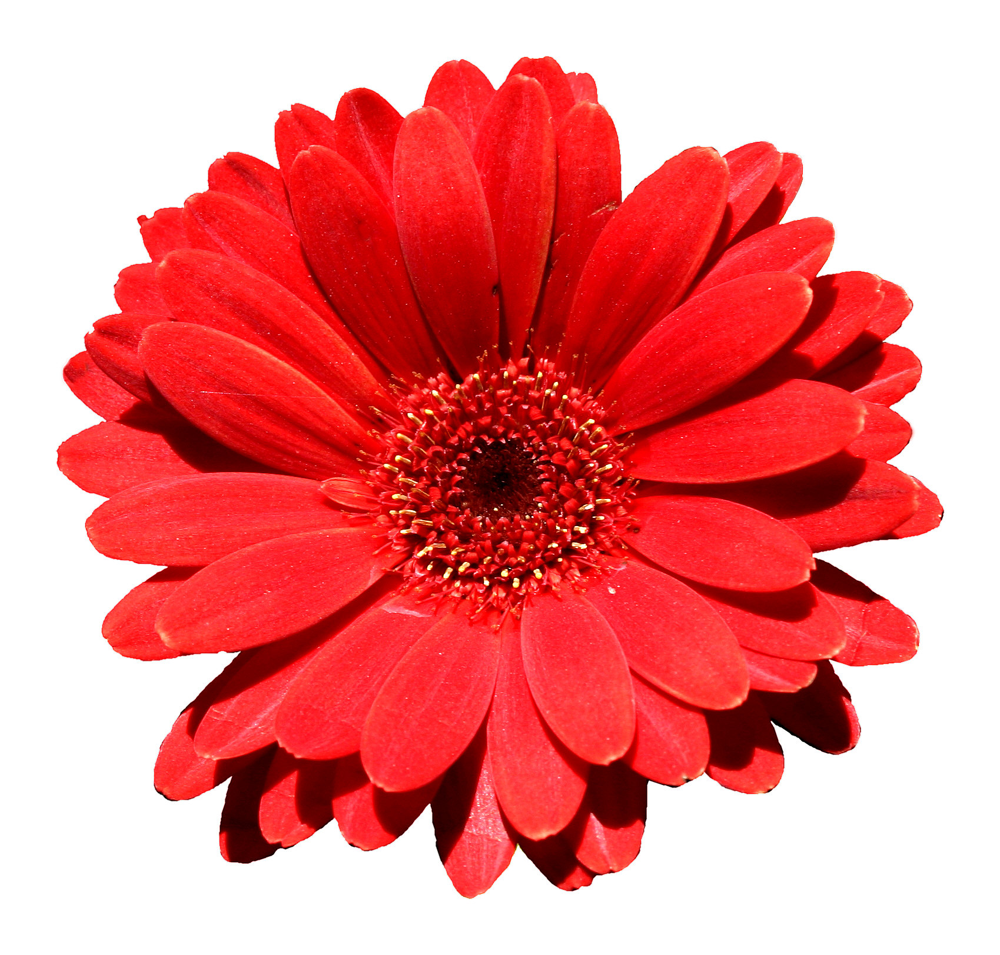

# Custom Syntax

`markdown-convert` supports several syntax shortcuts and extensions to standard Markdown.

Below are the most notable features:

## LaTeX Math Equations

```text
Inline equation: $E = mc^2$

Block equation:

$$\int_a^b f(x) \,dx = F(b) - F(a)$$
```


## Mermaid Diagrams

    ```mermaid
    graph TD;
        A-->B;
        A-->C;
        B-->D;
        C-->D;
    ```


## Syntax Highlighted Code Blocks

    ```python
    def greet(name):
        return f"Hello, {name}!"
    ```


## Pipe Tables

```text
| Name    | Age | City          |
| ------- | --- | ------------- |
| Alice   | 30  | New York      |
| Bob     | 25  | San Francisco |
| Charlie | 35  | Los Angeles   |
```


## Image alt-text attributes

```markdown

```


<details>

<summary>All supported attributes</summary>

- Size: `::tiny::`, `::small::`, `::medium::`, `::large::`, `::full::`
- Positioning: `::inline::`
- Shape: `::circle::`, `::rounded::`
- Filters: `::shadow::`, `::border::`, `::invert::`, `::grayscale::`


</details>

## Image captions

```markdown
_A beautiful flower._
```


## Custom Containers

```markdown
This text is hl{{highlighted}}.
```


<details>

<summary>All supported attributes</summary>

- Colors: `red/r`, `green/g`, `blue/b`, `yellow`, `orange`, `purple`, `white`, `black`, `gray`, `brown`, `pink`
- Underline: `underline/ul`
- Highlight: `highlight/hl`
- Key: `key`

You can use any arbitrary name for a container and define a matching class in your custom CSS to style it, for example:

```markdown
This text is sm{{small text}}.
```

```css
/* custom.css */
/* Use: markdown-convert --css=custom.css */
.sm {
    font-size: 0.8em;
}
```

</details>

## Page Breaks

```markdown
Two consecutive horizontal rules insert a page break:

---

---

This text is rendered on a new page.
```


